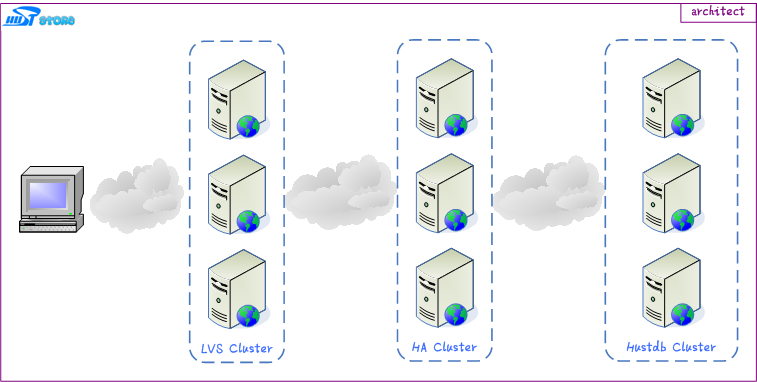

[简体中文](README_ZH.md)

# huststore - High-performance Distributed Storage #

`huststore` is a open source high performance distributed database system. It not only provides key-value storage service with extremely high performance, up to 100 thousand QPS, but also supports data structures like `hash`, `set`, `sorted set`, etc. Also, it can store binary data as value from a key-value pair, and thus can be used as an alternative of Redis.

In addtion, `huststore` implements a distributed message queue by integrating a special `HA` module, features including message Push Stream, and message Publish-SubScribe, these features can be used to as replacements of the corresponding features in rabbitmq and gearman.

## Features ##
`huststore` has two core components, `hustdb` and `HA`. `hustdb` uses `fastdb`,  a database engine developed by our own, in the fundamental architecture. `HA` is implemented as a `nginx` module. It is well-known that `nginx` is a industry-proven high quality code base, thus by inheriting it `huststore` gain the below advantages:

* High Throughput
`hustdb` uses [libevhtp](https://github.com/ellzey/libevhtp), a open source network library, as inner network communication system, by incorporating it with `fastdb` storage engine, `hustdb` achieves a extremely high performance, the benchmark shows that `QPS` hits **100 thousand** and even more.

* High Concurrency
Please refer to concurrency report of `nginx`

* High Availability
`huststore` architecture supports `Replication` (master-master), `load balance`. Therefore, the availability of `HA` is guaranteed by `master-worker` design. When one of `worker` process is down, the `master` will load another `workder` process, multiple `worker`s work independently, therefore guarantee the `HA` will work stably.

The fundamental design architecture of `huststore` guarantees the high availability, by using `master-master` architecture, when one of the storage node fails, `HA` module will re-direct the request to another live `master` node. Also, when a node failure happens, `HA` cluster will automatically re-balancing the data distribution, thus avoid single point of failure.

In addition, `HA` cluster uses a distributed architecture design by incorporating LVS as the director, each `HA` node is separated and work independently. When one of the `HA` node is down, LVS will re-direct the request to other available `HA` node, thus avoids `HA`'s' failure on single point node.

* Language-free Interface
`huststroe` use `http` as the communication protocol, therefore the client side implementation is not limited in any specific programming language.

* Support Binary Key-Value

## Operation and Maintenance ##

### Architect ###

### Deployment ###
* Distributed KV storage  = HA（hustdb ha） + DB（hustdb）
* Distributed Message Queue  = HA（hustmq ha） + DB（hustdb）

## Database Engine (fastdb) ##

## Dependency ##
* [leveldb](https://github.com/google/leveldb)
* [libcurl](https://curl.haxx.se/libcurl/)
* [libevhtp](https://github.com/ellzey/libevhtp)
* [zlog](https://github.com/HardySimpson/zlog)

## Documents ##

### Catalog ###
* [hustdb](hustdb/doc/doc/en/index.md)
* [hustmq](hustmq/doc/doc/en/index.md)

Above includes detailed documents of design, deployment documents, `API` usage and test samples. You can refer quickly to common problems in `FAQ` part.

### Fast Introduction ###
* [hustdb](hustdb/doc/doc/en/guide/index.md)
* [hustmq](hustmq/doc/doc/en/guide/index.md)

### API ###
* [hustdb](hustdb/doc/doc/en/api/index.md)
* [hustmq](hustmq/doc/doc/en/api/index.md)

### Advanced ###
* [hustdb](hustdb/doc/doc/en/advanced/index.md)
* [hustmq](hustmq/doc/doc/en/advanced/index.md)

### FAQ ###
* [hustdb](hustdb/doc/doc/en/appendix/faq.md)
* [hustmq](hustmq/doc/doc/en/appendix/faq.md)

## Table Content ##

`hustdb`
　　`doc`
　　`db`
　　`ha`
　　`sync`
`hustmq`
　　`doc`
　　`ha`

`hustdb/ha` provide service for storage engine, could configured with multi `worker`。
`hustmq/ha` provide service for message queue, can only configured with one **`worker`**。

## Performance ##

### `hustdb` ###

**Machine Configuration:** `24core，64gb，1tb sata(7200rpm)`

**Stress Test:** `100 concurrent，1000 thousand querys`

**DB CONF:** `single instance，thread model，10 workers`

**Benchmark Result:**

    （1）PUT
        <1>value：256B；     qps：95 thousand
        <2>value：1KB；      qps：85 thousand
        <3>value：4KB；      qps：25 thousand
        <4>value：16KB；     qps：7 thousand
        <5>value：64KB；     qps：2 thousand

    （2）GET
        <1>value：256B；     qps：100 thousand
        <2>value：1KB；      qps：10 thousand
        <3>value：4KB；      qps：25 thousand
        <4>value：16KB；     qps：7 thousand
        <5>value：64KB；     qps：2 thousand

    （3）DEL
        <1>value：256B；     qps：100 thousand
        <2>value：1KB；      qps：100 thousand
        <3>value：4KB；      qps：100 thousand
        <4>value：16KB；     qps：100 thousand
        <5>value：64KB；     qps：100 thousand

### `hustmq` ###

**Machine Configuration:** `24core，64gb，1tb sata(7200rpm)`

**Stress Test Parameters:** `100 concurrent，1000 thousand querys，single queue`

**DB Configuration:** `single instance，thread model，10 workers`

**Benchmark Result:**

    （1）PUT
        <1>item：256B；     qps：30 thousand
        <2>item：1KB；      qps：25 thousand
        <3>item：4KB；      qps：20 thousand
        <4>item：16KB；     qps：7 thousand
        <5>item：64KB；     qps：2 thousand

    （2）GET
        <1>item：256B；     qps：25 thousand
        <2>item：1KB；      qps：20 thousand
        <3>item：4KB；      qps：18 thousand
        <4>item：16KB；     qps：7 thousand
        <5>item：64KB；     qps：2 thousand

## LICENSE ##

`huststore` is licensed under [New BSD License](https://opensource.org/licenses/BSD-3-Clause), a very flexible license to use.

## Authors ##

* XuRuibo（hustxrb，hustxrb@163.com)
* ChengZhuo（jobs，yao050421103@163.com)
