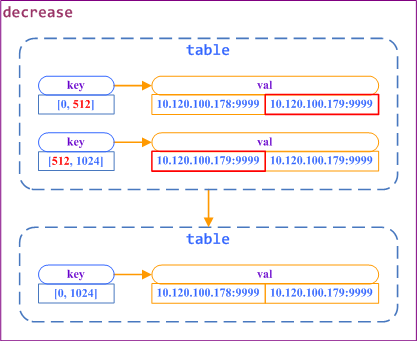

Load Balance Table
--

Path: `hustdb/ha/nginx/conf/hustdbtable.json`

### Configuration Examples ###

A standard configuration example for `hustdbtable`: 

    {
        "table":
        [
            { "item": { "key": [0, 128], "val": ["10.120.100.178:9999", "10.120.100.178:9998"] } },
            { "item": { "key": [128, 256], "val": ["10.120.100.178:9998", "10.120.100.179:9999"] } },
            { "item": { "key": [256, 384], "val": ["10.120.100.179:9999", "10.120.100.179:9998"] } },
            { "item": { "key": [384, 512], "val": ["10.120.100.179:9998", "10.120.100.180:9999"] } },
            { "item": { "key": [512, 768], "val": ["10.120.100.180:9999", "10.120.100.180:9998"] } },
            { "item": { "key": [768, 1024], "val": ["10.120.100.180:9998", "10.120.100.178:9999"] } }
        ]
    }

A standard configuration example for `hustdbtable` to expand: 

    {
        "table":
        [
            {
                "item": { "key": [0, 256], "val": ["10.120.100.178:9999", "10.120.100.179:9999"] },
                "increase":
                {
                    "low": { "key": [0, 128], "val": ["10.120.100.178:9999", "10.120.100.178:9998"] },
                    "high": { "key": [128, 256], "val": ["10.120.100.178:9998", "10.120.100.179:9999"] }
                }
            },
            {
                "item": { "key": [256, 512], "val": ["10.120.100.179:9999", "10.120.100.180:9999"] },
                "increase":
                {
                    "low": { "key": [256, 384], "val": ["10.120.100.179:9999", "10.120.100.179:9998"] },
                    "high": { "key": [384, 512], "val": ["10.120.100.179:9998", "10.120.100.180:9999"] }
                }
            },
            {
                "item": { "key": [512, 1024], "val": ["10.120.100.180:9999", "10.120.100.178:9999"] },
                "increase":
                {
                    "low": { "key": [512, 768], "val": ["10.120.100.180:9999", "10.120.100.180:9998"] },
                    "high": { "key": [768, 1024], "val": ["10.120.100.180:9998", "10.120.100.178:9999"] }
                }
            }
        ]
    }

A standard configuration example for `hustdbtable` to shrink: 

    {
        "table":
        [
            {
                "item": { "key": [0, 128], "val": ["10.120.100.178:9999", "10.120.100.178:9998"] },
                "decrease": { "remove": "10.120.100.178:9998", "replace_by": "10.120.100.179:9999" }
            },
            {
                "item": { "key": [128, 256], "val": ["10.120.100.178:9998", "10.120.100.179:9999"] },
                "decrease": { "remove": "10.120.100.178:9998", "replace_by": "10.120.100.178:9999" }
            },
            {
                "item": { "key": [256, 384], "val": ["10.120.100.179:9999", "10.120.100.179:9998"] },
                "decrease": { "remove": "10.120.100.179:9998", "replace_by": "10.120.100.180:9999" }
            },
            {
                "item": { "key": [384, 512], "val": ["10.120.100.179:9998", "10.120.100.180:9999"] },
                "decrease": { "remove": "10.120.100.179:9998", "replace_by": "10.120.100.179:9999" }
            },
            {
                "item": { "key": [512, 768], "val": ["10.120.100.180:9999", "10.120.100.180:9998"] },
                "decrease": { "remove": "10.120.100.180:9998", "replace_by": "10.120.100.178:9999" }
            },
            {
                "item": { "key": [768, 1024], "val": ["10.120.100.180:9998", "10.120.100.178:9999"] },
                "decrease": { "remove": "10.120.100.180:9998", "replace_by": "10.120.100.180:9999" }
            }
        ]
    }
    
### Field structure ###

[`table`](table/table.md)   
　　[`hash_item`](table/hash_item.md)  
　　　　[`item`](table/item.md)  
　　　　　　[`key`](table/key.md)  
　　　　　　[`val`](table/val.md)  
　　　　[`increase`](table/increase.md)  
　　　　　　[`low`](table/low.md)  
　　　　　　　　[`key`](table/key.md)  
　　　　　　　　[`val`](table/val.md)  
　　　　　　[`high`](table/high.md)  
　　　　　　　　[`key`](table/key.md)  
　　　　　　　　[`val`](table/val.md)  
　　　　[`decrease`](table/decrease.md)  
　　　　　　[`remove`](table/remove.md)  
　　　　　　[`replace_by`](table/replace_by.md)  

### Field restrictions ###

* [`increase`](table/increase.md) and [`decrease`](table/decrease.md) are used for cluster expansion and shrink, only one of them can be defined at the same time.

* [`key`](table/key.md) is used to define `hash` range for load balance, the maximum legitimate range is `[0, 1024)`. In real configuration, **each range section must be continuous**, otherwise, some `key`s will be not be able to be `hash`ed to the corresponding storage node.

* [`val`](table/val.md) is used to store machine list that store actual data. In fact, this value is used to store master node and backup master node (in **master - master** architecture)

* [`increase`](table/increase.md) cuts a range section into two sections, and the two sections must be **continuous**. e.g. `[0, 1024]` can be cut into `[0, 512]`, `[512, 1024]`.  
Check this for more details  

* [`decrease`](table/decrease.md) can only be used to join two continuous sections. e.g. `[0, 512]` and `[512, 1024]` can be joined into `[0, 1024]`.   
Check this for more details  

### Generate load balance table ###

Tool path: `hustdb/ha/nginx/conf/gen_table.py`

    usage:
        python gen_table.py [host_file] [output]
    sample:
        python gen_table.py hosts hustdbtable.json  
e.g. create a new file named `hosts` in directory `hustdb/ha/nginx/conf`, edit contents as below:

    192.168.1.101:9999
    192.168.1.102:9999
    192.168.1.103:9999

Execute the command:

    python gen_table.py hosts hustdbtable.json  
Open `hustdbtable.json`, we can see the following contents:
    
    {
        "table": [
            {
                "item": {
                    "val": [
                        "192.168.1.101:9999", 
                        "192.168.1.102:9999"
                    ], 
                    "key": [
                        0, 
                        256
                    ]
                }
            }, 
            {
                "item": {
                    "val": [
                        "192.168.1.102:9999", 
                        "192.168.1.103:9999"
                    ], 
                    "key": [
                        256, 
                        512
                    ]
                }
            }, 
            {
                "item": {
                    "val": [
                        "192.168.1.103:9999", 
                        "192.168.1.101:9999"
                    ], 
                    "key": [
                        512, 
                        1024
                    ]
                }
            }
        ]
    }

In real deployment environment, **it is strongly recommanded to use this method to generate load balance table**.

[Previous](conf.md)

[Home](../../index.md)
