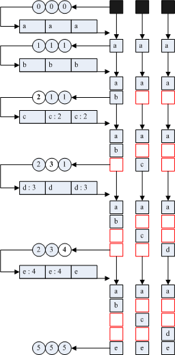

ha
--

### Outline ###

The following is http interface provided by `hustmq ha`: 

* [autost](ha/autost.md)
* [stat_all](ha/stat_all.md)
* [stat](ha/stat.md)
* [put](ha/put.md)
* [get](ha/get.md)
* [ack](ha/ack.md)
* [timeout](ha/timeout.md)
* [lock](ha/lock.md)
* [max](ha/max.md)
* [purge](ha/purge.md)
* [worker](ha/worker.md)
* [evget](ha/evget.md)
* [evsub](ha/evsub.md)
* [sub](ha/sub.md)
* [pub](ha/pub.md)
* [do_get](ha/do_get.md)
* [do_post](ha/do_post.md)
* [do_get_status](ha/do_get_status.md)
* [do_post_status](ha/do_post_status.md)

### Common Question ###

* Return Value:  
Success if `http code` is `200` is `http code`, fail if `404`. 

* About `http basic authentication`  
All Test cases described by command `curl` in this section, is based on the assumption: `http basic authentication` is closed.  
Refer to [Section](../advanced/ha/nginx.md)

* About scenarios of `timeout` interface   
Assume that queue name is `test_queue`, data is `test_data`.
    * Put data `test_data` into queuen `test_queue` by `put` interface.
    * Set up 1 minute timeout for queue `test_queue` by `timeout` interface.
    * Fetch data from queue `test_queue` by `get` interface with `ack` argument which value is false 
    * Scenario 1:
        * Waiting at least 1 minute without `ack` operation
        * Fetch data from queue `test_queue` by `get` interface again, and it still turns out to be data `test_data` 
    * Scenario 2:
        * Confirm data by `ack` interface without waiting 
        * Fetch data from queue `test_queue` by `get` interface again, and it must not be data `test_data` 

* About the Operation Mechanism of `http push`  
[evsub](ha/evsub.md), [sub](ha/sub.md), [pub](ha/pub.md) implement `http push` mechanism, used as Data Streaming Push. The process is as followed:
    * `subscriber` subscribes data from queue `test_queue` by `evsub` interface
    * `publisher` publishes data to queue `test_queue` by `pub` interface
    * `hustmq ha` background system `autost` can refresh `hustmq` cluster status, check whether data is available
    * `hustmq ha` check any data from queue `test_queue`, and fetch `uri` from queue `test_queue` (include `sub`), then package into `http` header, and reply `307` to `subscriber`, and `subscriber` get latest data from queue `test_queue` by latest `uri` 
In order to ensures eventual consistency of pushing data, and `hustmq` implements distributed lightweight sliding window mechanism. Similar to the following picture:  
  
Notice:  `[a, b, c, d, e]` represent written data, read part represent write failure data, `c:2` represent that it update `idx` to latest value forcibly when write data `c`. When `hustmq ha` discovers `idx` is inconsistent between   `hustmq` nodes, it will notifies those nodes to update `idx` to latest value, thus ensuring eventual consistency. 

* About the Operation Mechanism of `long polling`
[evget](ha/evget.md) and [put](ha/put.md) implement `long polling` mechanism. The process is as followed:
    * `client A` send `evget` request to queue `test_queue`, and it will supends by `hustmq ha`
    * `client B` send `put` request to queue `test_queue`
    *  The background system of `hustmq ha` check whether there is any data, by `autost` to refresh `hustmq` cluster status
    * When `hustmq ha` discover any data from queue `test_queue`,  and fetch `uri` from queue `test_queue`, then package into `http` header, and reply `307` to `client A`, and `client A` get latest data from queue `test_queue` by latest `uri`     
    **Animation: **  
    

* Distributed Processes Pool based on `http`     
For traditional processes pool implementation, all `worker` processes distributed on same machine, and with a single point limit. [do_get](ha/do_get.md) and [do_post](ha/do_post.md) can implement `http` based mechanisms of distributed processes pool. The process is as followed:  
    * `worker` send `do_post` request to `hustmq ha`, and it suspended. It called "Claim Tasks"
    * `client` send `do_get` request to `hustmq ha`, and it suspended. It called "Delivery Task"
    * `hustmq ha` assign task delivered by `client` to `worker` for processing
    * After task processed, `worker` return process result by `do_post`
    * `hustmq ha` forward result to `client`  

For the above process, it is synchronous for `client`'s perspective. `client` can handle message queue by synchronous way without maintain context, thus simplifying coding; It is asynchronous for `worker`'s perspective, it act like `worker` process of traditional processes pool without single point or language limit. It is new `RPC` design with flexible and simple deployment. The realization of each `worker` may not necessarily be limited to a particular programming language, just need called by follow `do_post` specification.

[Pervious](index.md)

[Home](../index.md)